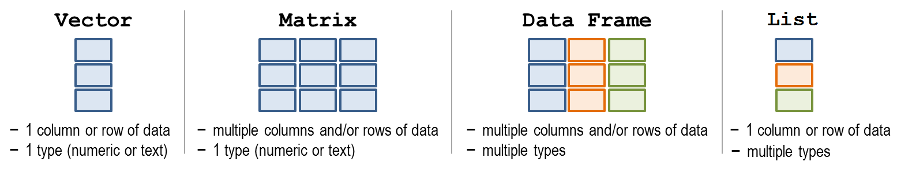

<style>
bold {font-weight: bold; }

.section .reveal .state-background {
    background: white;
}

.section .reveal p {
   color: black;
   text-align:center;
   font-size: 1.8em;
}

.section .reveal h1,
.section .reveal h2 {
    color: black;
    text-align:center;
    width:100%;
}


</style>

An introduction to R
========================================================
author: Jorge Cimentada and Basilio Moreno
date:  23rd of June of 2017
class: section
font-family: 'Helvetica'
width: 1800
height: 900
 
<div align="center">

</div>

How to install R?
========================================================

Luckily, you guys have R and Rstudio installed, so you don't have to worry about this!

But if you want to install it at home, please follow [this guide](https://github.com/cimentadaj/Rseminars/blob/master/RonR_Second_Seminar/README.md)

That guide can help you install

* R
* Rstudio
* And `swirl`, a package in which you could do a bunch of exercises as homework!

What is R?
========================================================

R is a programming language designed to do data analysis, usually interactive.

R is helpful for..

* Getting that darn excel/stata file into R (importing)
* Turning that very ugly dataset into something to work with (data cleaning)
* Automating your weekly reports (automating tasks)
* Analyzing data (modeling)
* Creating nicely formatted documents (communicating results)
* Building your own commands to do specific things (functions)
* Building very creative graphics

* Among many things...

And so.. what is Rstudio?
========================================================

Rstudio is just a nice software to run R!
 
<!-- Arreglar las imagenes -->

<div align="center">

</div>

***

<div align="center">

</div>

And so.. what is Rstudio?
========================================================

<div align="center">

</div>

Let's get to it then!
========================================================

R is an interactive language. That means that if you type a number, you will get a number.


```r
#Input
10
```

```
[1] 10
```


```r
#Input
5
```

```
[1] 5
```

Introduction to R objects
========================================================

R is also a calculator

Try typing these operations in R:

* `5 + 5`
* `10 - 5`
* `10 * 5`
* `20 / 10`
* `(10 * 20) - 5 / 2 + 2`
* `2 ^ 3`

Before we continue, what type of operations are these?

Answers in next slide!

Introduction to R objects
========================================================

* Addition
* Subtraction
* Multiplication
* Division
* A combination of all
* Exponentiation

Numbers in R are called `numerics`.

For example:

```r
is.numeric(10)
is.numeric(10 + 20)
is.numeric(10 / 2)
```

Introduction to R objects
========================================================

Having single numbers, like 10, is not very useful.

We want something similar to a column of a dataset, like age or income.

We can do that with `c()`, which stands for `concatenate`.


```r
c(32, 34, 18, 22, 65)
```

```
[1] 32 34 18 22 65
```

Read this expression as: concatenate these numbers into a single object.

Introduction to R objects
========================================================

We can also give it a name, like age.


```r
age <- c(32, 34, 18, 22, 65)
```

* Why didn't the result get printed?
* Where is this age object at?
* What is formally the age object?

Introduction to R objects
========================================================
We just created our first variable! The typical SAS/Excel/Stata column.

In R, these objects are called '**vectors**'.

Vectors can have several flavours:

* Numerics (we just saw one)
* Logicals
* Characters
* Factors

Introduction to R objects
========================================================

Suppose these ages belong to certain people. We can create a character vector with their names.

Following this guideline, create it yourself.

* Create a character vector with `c()`
* Include the names Paul, Maria, Andres, Roberto and Alicia inside
* `wrap` every name in quotes like this "Paul", "Maria", etc... This will make R understand that input as characters.

Introduction to R objects
========================================================

Answer:


```r
c("Paul", "Maria", "Andres", "Robert", "Alicia")
```

```
[1] "Paul"   "Maria"  "Andres" "Robert" "Alicia"
```

We can also give it a name, like participants.


```r
participants <- c("Paul", "Maria", "Andres", "Robert", "Alicia")
```

Introduction to R objects
========================================================

Character vectors are filled by strings, like "Paul" or "Maria".

Can we do operations with strings?


```r
"Paul" + "Maria"
```

```
Error in "Paul" + "Maria": argumento no-numérico para operador binario
```

Makes sense.. we can't add any letters.

Alright, we're set.  Concatenate the numeric vector `age` and `participants`.

Introduction to R objects
========================================================


```r
c(age, participants)
```

```
 [1] "32"     "34"     "18"     "22"     "65"     "Paul"   "Maria" 
 [8] "Andres" "Robert" "Alicia"
```


* What's the problem with this result?


========================================================

# This breaks an R law!

We joined a `numeric` vector and a `character` vector.

Vectors can *ONLY* be of one class.


```r
c(1, "one") # forces to character vector
```

```
[1] "1"   "one"
```

```r
c(1, "1") # note that the first one is a numeric, while the second is a character
```

```
[1] "1" "1"
```

Introduction to R objects
========================================================

Now, which of these people has an age above `20`?


```r
age > 20
```

```
[1]  TRUE  TRUE FALSE  TRUE  TRUE
```

* That's a logical vector.

Contrary to `character` and `numeric` vectors, `logical` vectors can only have three values:
* `TRUE`
* `FALSE`
* `NA` (which stands for "Not available".)

Introduction to R objects
========================================================

`logicals` can be created manually or with a `logical` statement.


```r
c(TRUE, FALSE, TRUE, TRUE)
```

```
[1]  TRUE FALSE  TRUE  TRUE
```

```r
age < 60
```

```
[1]  TRUE  TRUE  TRUE  TRUE FALSE
```

The above expression tests for the logical statement.

For example,

```
   32    34    18    22    65 
 TRUE  TRUE  TRUE  TRUE FALSE 
```

Introduction to R objects
========================================================

You can also write `T` or `F` as short abbreviations of `TRUE` and `FALSE`.


```r
c(T, T, F, T) == c(TRUE, TRUE, FALSE, TRUE)
```

```
[1] TRUE TRUE TRUE TRUE
```

Which is comparing:


```
 TRUE  TRUE FALSE  TRUE 
  "T"   "T"   "F"   "T" 
```

But behind the scenes, `TRUE` and `T` are just a `1` and `F` and `FALSE` are just a `0`.

What is the result of this?


```r
T + 5
TRUE - 5
FALSE + TRUE
T + T - FALSE
```

Introduction to R objects
========================================================
incremental: true

Now that you know that.. what would be the class of the following vectors?


```r
c(5, TRUE)
c(5, "FALSE")
c(FALSE, TRUE)
c(1, FALSE)
```

* numeric: TRUE is coerced to 1
* character: "FALSE" is a string, can't be turned to a number
* logical: both elements are logical!
* numeric: FALSE is coerced to 0

Introduction to R objects
========================================================
 
What do we know so far?

* Numeric vectors
* Character vectors
* Logical vectors
* How to assign a name to these vectors
* Vectors can contain only *one* class of data

What's missing?

### Factors

Introduction to R objects
========================================================

Factors are R's way of storing **categorical variables**.

Categories such as:

- 'Male' and 'Female' or 'Married' and 'Divorced'
- 'Good', 'Middle' and 'High'


```r
gender <- c("Male", "Female", "Male", "Male", "Female")

# Can be turned into

gender <- factor(gender)
```

Introduction to R objects
========================================================

A factor is just a way of saying that a variable has unique values! And they can be ordered.


```r
elm <- c("Good", "Bad", "Medium")
(elm_factor <- factor(elm, levels = c("Bad", "Medium", "Good"), ordered = T))
```

```
[1] Good   Bad    Medium
Levels: Bad < Medium < Good
```

***
This has consequences


```r
table(elm)
```

```
elm
   Bad   Good Medium 
     1      1      1 
```


```r
table(elm_factor)
```

```
elm_factor
   Bad Medium   Good 
     1      1      1 
```

Introduction to R objects
========================================================

Factors are useful for some specific operations like:

- Changing order of levels for terms in modelling
- Changing order of axis labels in plots
- Among other things..

In many cases you can use characters to do what you would want with factors!

Introduction to R objects
========================================================

Now, have you noticed that we've been assigning names to things?


```r
age
```

```
[1] 32 34 18 22 65
```

The name `age` holds all these elements inside. How do we know where all the variables we've created are?

Let's ask R what objects can be listed from our workspace or environment.

```r
ls()
```

```
[1] "age"          "elm"          "elm_factor"   "gender"      
[5] "lgl"          "participants"
```

Introduction to R objects
========================================================

So far, we have a bunch of variables scattered around our workspace. This is usually no the way to go!

### We want to group similar things in the same place.


```r
our_df <- data.frame(name = participants, age = age, gender = gender, age_60 = lgl)
our_df
```

```
    name age gender age_60
1   Paul  32   Male   TRUE
2  Maria  34 Female   TRUE
3 Andres  18   Male   TRUE
4 Robert  22   Male   TRUE
5 Alicia  65 Female  FALSE
```

A data frame is usually the primary structure of analysis in R

Introduction to R objects
========================================================

It's important that you understand the thing that defines a data frame.

- A data frame has *rows* and *columns*, more technically called *dimensions*.
- Data frames have two dimensions.


```r
dim(our_df)
```

```
[1] 5 4
```

```r
nrow(our_df)
```

```
[1] 5
```

```r
ncol(our_df)
```

```
[1] 4
```

Introduction to R objects
========================================================

Data frames are very distinctive because they can hold any type of vector.

Matrices cannot!


```r
our_matrix <- matrix(1:20, ncol = 4, nrow = 5)
our_matrix
```

```
     [,1] [,2] [,3] [,4]
[1,]    1    6   11   16
[2,]    2    7   12   17
[3,]    3    8   13   18
[4,]    4    9   14   19
[5,]    5   10   15   20
```

- Matrices are very similar to data frames.
- They have same number of dimensions.
- You can choose rows/columns in similar ways.

Introduction to R objects
========================================================

Finally, we're missing the secret ingridient the differentiates both matrices and data frames.

# Lists

Introduction to R objects
========================================================

Think of lists as a bag that can store anything.


```r
our_list <- list(names = participants, gender = gender, age = age)
our_list
```

```
$names
[1] "Paul"   "Maria"  "Andres" "Robert" "Alicia"

$gender
[1] Male   Female Male   Male   Female
Levels: Female Male

$age
[1] 32 34 18 22 65
```

This is a bag that has 3 objects.
- A charachter
- A factor
- A numeric

Introduction to R objects
========================================================

Think outside the box... when I say anything, I mean ANYTHING!


```r
complex_list <- list(df = our_df[1:3, ], matrix = our_df[1:3, ], avg_age = mean(age))
complex_list
```

```
$df
    name age gender age_60
1   Paul  32   Male   TRUE
2  Maria  34 Female   TRUE
3 Andres  18   Male   TRUE

$matrix
    name age gender age_60
1   Paul  32   Male   TRUE
2  Maria  34 Female   TRUE
3 Andres  18   Male   TRUE

$avg_age
[1] 34.2
```

Introduction to R objects
========================================================

To sum up, these are the 4 types of data structures available in R.
<div align="center">

</div>

Introduction to R objects
========================================================

Now I'm gonna rock your world...

A data frame is a list (because it can have any class) with a row and column dimensions.


```r
data.frame(our_list)
```

```
   names gender age
1   Paul   Male  32
2  Maria Female  34
3 Andres   Male  18
4 Robert   Male  22
5 Alicia Female  65
```

========================================================

# To be continued....
