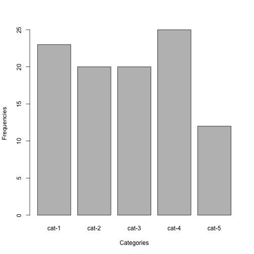
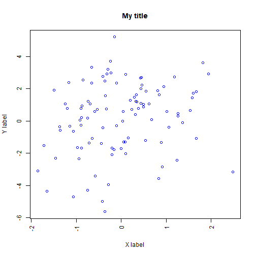

<style>
bold {font-weight: bold; }

.section .reveal .state-background {
    background: white;
}

.section .reveal p {
   color: black;
   text-align:center;
   font-size: 1.8em;
}

.section .reveal h1,
.section .reveal h2 {
    color: black;
    text-align:center;
    width:100%;
}


</style>

An introduction to R
========================================================
author: Jorge Cimentada and Basilio Moreno
date:  23rd of June of 2017
class: section
font-family: 'Helvetica'
width: 1800
height: 900

<div align="center">

</div>

An introduction to functions
========================================================

Functions are R's black box...
Take the function `mean` as example.


```r
mean(iris$Sepal.Length)
```

```
[1] 5.843333
```

Functions are just like other 'commands' in Stata, SPSS or SAS.


```r
SPSS: mean()
Stata: mean; egen mean
SAS: MEAN
```

An introduction to functions
========================================================

- R has evolved so fast that there are thousands of functions.
- Around 250,000 to be more exact! 190 times more than SAS.

- We don't have enough time to cover functions, for that, see [here](http://adv-r.had.co.nz/Functions.html).
- Today we'll cover the basics. Let's start!

An introduction to functions
========================================================
incremental: true

Can anyone tell me what does the mean() function do?


<div align="left">

</div>

- `sum()` all numbers and divide by the total `length()` of the vector.
- Create a vector from 1:100 and do it yourself!

An introduction to functions
========================================================
incremental: true


```r
mean_vector <- 1:100
sum(mean_vector)/length(mean_vector)
```

```
[1] 50.5
```

How can we turn this into a function?


```r
our_mean <- function(x) {
  sum(x)/length(x)
}

our_mean(mean_vector)
```

```
[1] 50.5
```

```r
mean(mean_vector)
```

```
[1] 50.5
```

An introduction to functions
========================================================
Great job!


```r
our_mean <- function(x) {
  sum(x)/length(x)
}
```

- `our_mean` is the name of our function
- `x` is the only argument (but there can be more!)
- Everything inside `{}` is the code to execute, more formally, the body of the function.

An introduction to functions
========================================================
incremental: true

.1 Create a function called `adder`

.2 It accepts two arguments called `x` and `y`

.3 Inside the body, add `y` and `x` and don't give with it a name.


```r
adder <- function(x, y) {
  y + x
}
```

- Generally speaking, what does this function do?

An introduction to functions
========================================================

You often create function to avoid repeating code.

Example:


```r
mtcars_two <- mtcars

mtcars_two$cyl <- as.character(mtcars$cyl)
mtcars_two$vs <- as.character(mtcars$vs)
mtcars_two$am <- as.character(mtcars$am)
mtcars_two$gear <- as.character(mtcars$gear)
mtcars_two$carb <- as.character(mtcars$carb)
```

A bit tiring, isn't?

- Let's focus on which things actually change in this code.

An introduction to functions
========================================================
incremental: true

- Write a function called 'to_character'
- It accepts two arguments, `old_var` and `new_var`
- The function should contain an expression where you turn a variable into character and then save that a new name.
- In short, similar to the code from above.

An introduction to functions
========================================================
incremental: true
First we start with the code that works


```r
old_var <- "cyl"
new_var <- "cyl"

as.character(mtcars$old_var)
```
Does this work?


```r
as.character(mtcars[, old_var])
```

Now we have to assign the new name.


```r
mtcars$new_var <- as.character(mtcars[, old_var])
```

Does this work?


```r
mtcars[new_var] <- as.character(mtcars[, old_var])
```

An introduction to functions
========================================================
incremental: true

Okay, so we got this working...

```r
old_var <- "cyl"
new_var <- "cyl"

mtcars[new_var] <- as.character(mtcars[, old_var])
```

Wrap it in a function!


```r
to_character <- function(old_var, new_var) {
  mtcars[new_var] <- as.character(mtcars[, old_var])
  mtcars
}
```


```r
our_mtcars <- to_character(new_var = "cyl", old_var = "cyl") # why did this order change?
class(our_mtcars$cyl)
```

```
[1] "character"
```

An introduction to functions
========================================================
incremental: true

All good and well but this only works for the mtcars dataset!

- Add a new argument `df` to the `to_character` function
- Replace `mtcars` with `df` inside the function


```r
to_character <- function(df, old_var, new_var) {
  df[new_var] <- as.character(df[, old_var])
  df
}
```

Let's try it with the `iris` data! 
This data frame is already available in the working environment. 
Check `head(iris)`


```r
our_iris <- to_character(iris, "Species", "Species") # why didn't I name the arguments?
class(our_iris$Species)
```

```
[1] "character"
```

An introduction to functions
========================================================

Just as in our own function, functions can have many many arguments or options.

For example..

```r
url <- "https://gist.githubusercontent.com/seankross/a412dfbd88b3db70b74b/raw/5f23f993cd87c283ce766e7ac6b329ee7cc2e1d1/mtcars.csv"
mtcars <- read.csv(file = url, sep = ",", header = TRUE, row.names = 1)
```

Answer this:
- What's the function name?
- What do each of their arguments do?

An introduction to functions
========================================================

When you don't know what a function or its arguments do, search for its help page.

- `?read.csv`

Things to consider:

- Read argument definitions
- Checkout the examples
- Run them right away!


An introduction to functions
========================================================
- `?mean`
- `?sd`

With this vector

```r
vec <- sample(c(1:100, NA), 1000, replace = T)
```

- Calculate the `mean` and `sd` (standard deviation)

An introduction to functions
========================================================

In R everything is a function, which means that you should learn how to understand functions.


```r
x <- table(sample(1:5, 100, replace = T))
```

Using ?barplot and barplot(), reproduce the plot from below exactly.

- Read carefuly over each argument
- First run `barplot(x)` to see what you're missing



An introduction to functions
========================================================

Take it a bit further and create a plot like this..


```r
x <- rnorm(100)
y <- x + rnorm(100, sd = 2)
```



This will require to read ?plot in detail! That's the whole point of understanding functions.

Start simple by running `plot(x, y)`!

An introduction to functions
========================================================

Help files have several sections you need to be aware of.

- Description *
- Usage *
- Arguments *
- Details
- Value *
- Note
- References
- See also
- Examples *

An introduction to functions
========================================================

For example, let's create a data frame. This would be the function to use.


```r
?data.frame
```

How many arguments have I used?

```r
data.frame(num = 1:10, char = letters[1:10], sample(c(T, F), 10, replace = T))
```

What changed from the example in the _help_ document?

```r
data.frame(num = 1:10, char = letters[1:10], sample(c(T, F), 10, replace = T),
           row.names = 1, check.rows = TRUE, fix.empty.names = FALSE)
```

An introduction to functions
========================================================

In the RECSM seminars you'll be using some advanced R which is why we need to take you to the limit!

* Run one example with the `lm` (Fitting linear models) function and the `mtcars` dataset.
* Use `by` to split `mtcars` by the factor `cyl` and apply the `summary` function
* Create a new variable in `mtcars` called `mpg_mean` using `ifelse`. It gives back a 1 when mpg is above or equal to the mean and 0 when it's not.

Remember to use `?function`


```r
lm(mpg ~ vs + cyl, data = mtcars)
by(mtcars, mtcars$cyl, summary)
mtcars$mpg_mean <- ifelse(mtcars$mpg >= mean(mtcars$mpg), 1, 0)
```

An introduction to functions
========================================================
incremental: true
Packages are one of the most important things in R.

- They allow people to share ideas/code
- They are well documented
- They can contain functions or datasets

Where are R packages? In something called `CRAN` (Comprehensive R Archive Network)

How do you install them?


```r
install.packages("cowsay")
install.packages("lme4")
```

An introduction to functions
========================================================

How do you use them?
 Once installed we will have to call them in order to get them running in the current session.


```r
library("cowsay")
library("lme4")
```


Here we have some more info provided by the help documents. 


```r
?cowsay::say
?lme4::nlmer
```

Read a bit, and then check the examples!

An introduction to functions
========================================================

I think you're ready for some real R programming...
